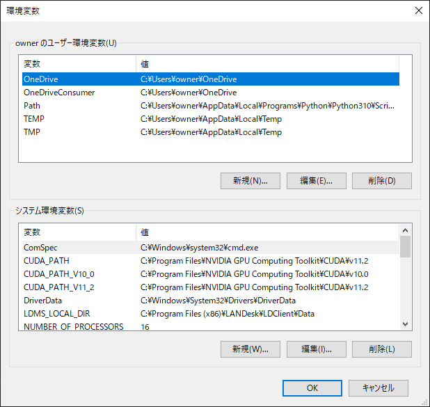
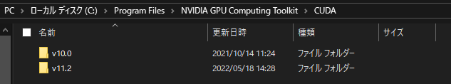
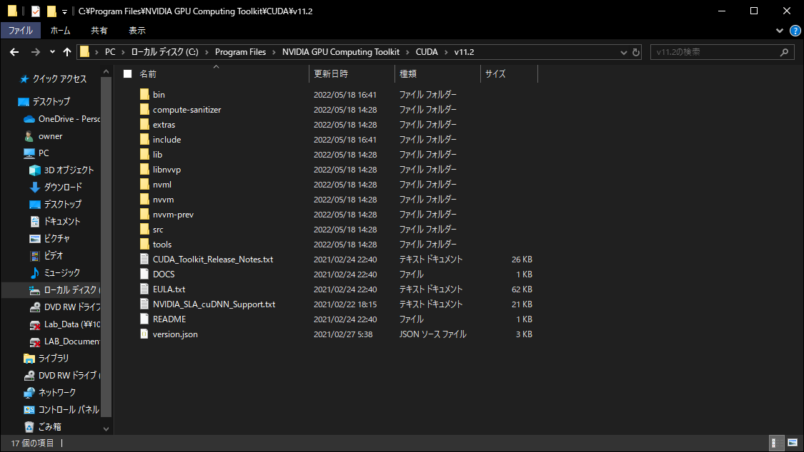
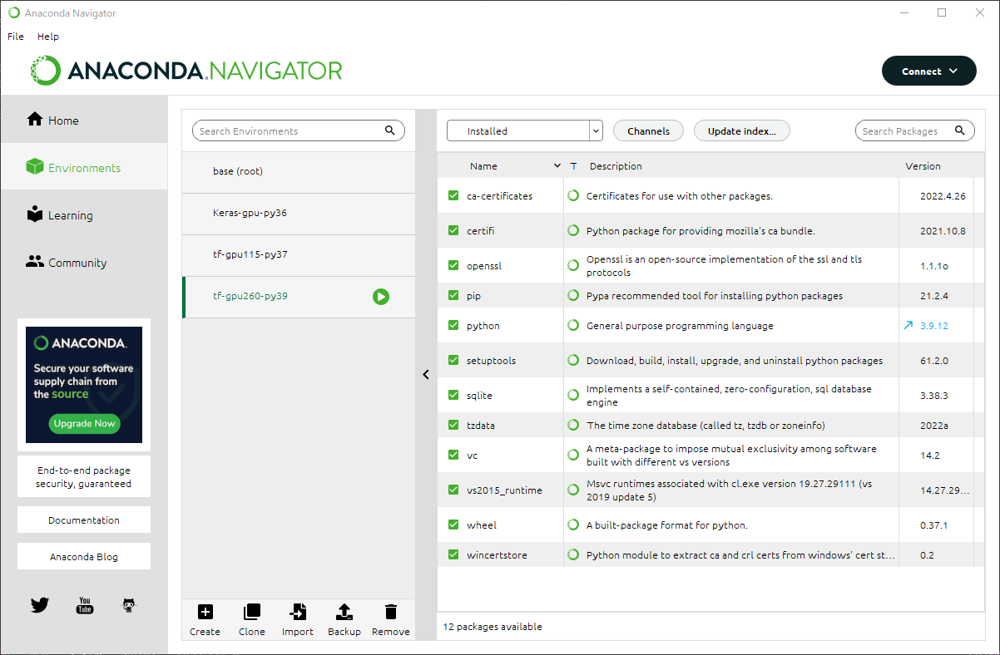

# How to Install Multiple versions of tensor-flow-GPU, CUDA and cuDNN on the Windows

## You need to install the following containts before 1st step
- anaconda
- Microsoft Visual Studio
    - Tensor-flow-gpu requires a Nsight included in Visual studio.
- GPU Driver
    - Clean install is better way if already installed.

## 1. Check the versions
Check the versions that you want to install at this URL.\
https://www.tensorflow.org/install/source_windows#gpu


## 2. Install CUDA
### 2.1 How to install CUDA
You can install CUDA at this URL.\
https://developer.nvidia.com/cuda-toolkit-archive

If the installation is successful, You can see the path at "Edit the system environment variable" like this image.\
(If your Windows language is Japanese, It is called "システム環境変数の編集".)

```
CUDA_PATH_V10_0 C:\Program Files\NVIDIA GPU Computing Toolkit\CUDA\v10.0
CUDA_PATH_V11_2 C:\Program Files\NVIDIA GPU Computing Toolkit\CUDA\v11.2
```



### 2.2 How to install multiple versions of the CUDA on one environment
You can install multiple versions of CUDA by installing in the same way as 2.1.\
If you install two different versions of CUDA, CUDAs are installed as shown in the following image.



## 3. Install cuDNN
## **Note the supported CUDA version**
The same version of cuDNN may support different versions of CUDA.

You can install cuDNN at this URL.(You need to log in to your NVIDIA account.)\
https://developer.nvidia.com/rdp/cudnn-archive

1. Unzip the file
2. Copy and paste the unzipped file's bin, include and lib into the folder where CUDA is installed and overwrite it.

Example of CUDA installed path
```
C:\Program Files\NVIDIA GPU Computing Toolkit\CUDA\v11.2
```


## 4 Restart the PC
Restart the PC to set the path.

## 5 Create the environment on anaconda
1. Start the anaconda.
2. Go to the "Environments" tab.
3. Click the "Create" button.
4. Set the name you can recognize versions
5. Select the version of the Python.
    - ## **Note the supported Python version**
6. Click the "Create" button.



## 6 Install tensor-flow-gpu
1. Go to the "home" tab.
2. Select the cahnnel you created at 5 on "Aplications on".
3. Click the "Install" button on the CMD.exe Prompt to install Prompt.
4. Click the "Launch" button on the CMD.exe Prompt.
5. Type ```pip install tensorflow-gpu==x.x.x``` on the CMD.exe Prompt to specify version and install.

    Example fo command in version 2.6.0
    ```
    pip install tensorflow-gpu==2.6.0
    ```
6. Type following command to check the path to use GPU.
    ```
    where cudnn64_7.dll
    ```
7. Type following command to check that the GPU is recognized.
    ```
    python -c "from tensorflow.python.client import device_lib;print(device_lib.list_local_devices());"
    ```
    If the following message is displayed, the installation was successful.
    ```
    device_type: "GPU"
    memory_limit: 8467211878
    locality {
    bus_id: 1
    links {
    }
    ```

## 7 Check operation with Grad-CAM
1. Install the modules.

    You can check installed module with following command.
    ```
    pip list
    ```
    ## **Note the supported module version**

    - matplotlib
    ```
    pip install matplotlib
    ```
    - scikit-learn
    ```
    pip install scikit-learn
    ```
    - OpenCV
    ```
    pip install opencv-python
    ```
    - numpy
    ```
    pip install numpy
    ```

2. Run Grad-CAM code.
    - Grad-CAM code is on this URL.\
    https://github.com/14haru/zhang_lab/Codes/Grad-CAM/Grad-CAM.py

## 8 Solve the error issue

**You may can run Grad-CAM code without this step.**
### Module version error.
1. Type following command to check supported version
    ```
    pip check
    ```
2. Install supported version module like following command.
    ```
    pip install keras==2.6.0
    ```
3. Type `pip check` again to check the installation was successful.


## References
https://qiita.com/momendoufu/items/6a0bc0701d797ef5b727
https://hahaeatora.hateblo.jp/entry/2020/06/30/200000
http://tecsingularity.com/cuda/version/

